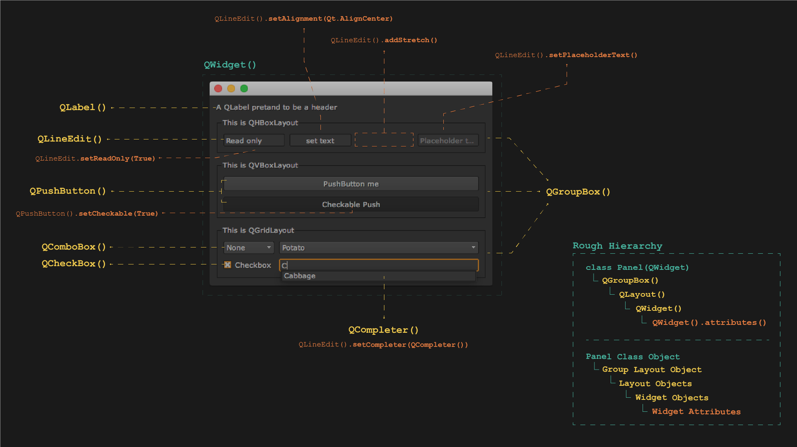

# PySide with a graphic



###### Source code for above image
```python
from PySide.QtGui import *
from PySide.QtCore import *
import sys


class Panel(QWidget):
    def __init__(self):
        super(Panel, self).__init__()


     	# QLabel --------------------
    	label = QLabel('A QLabel pretand to be a header')


        # Group Top --------------------
        group_top = QGroupBox('This is QHBoxLayout')
        group_top_layout = QHBoxLayout()

        line1 = QLineEdit("Read only")
        line1.setReadOnly(True)
        line2 = QLineEdit()
        line2.setText("set text")
        line2.setAlignment(Qt.AlignCenter)
        line3 = QLineEdit()
        line3.setPlaceholderText("Placeholder text...")

        group_top_layout.addWidget(line1,1)
        group_top_layout.addWidget(line2,1)
        group_top_layout.addStretch(1)
        group_top_layout.addWidget(line3,1)
        group_top.setLayout(group_top_layout)


        # Group Mid --------------------
        group_mid = QGroupBox('This is QVBoxLayout')
        group_mid_layout = QVBoxLayout()

        push1 = QPushButton('push')
        push1.setText("PushButton me")
        push1.setShortcut('u')
        push1.setToolTip("This is a tooltip when hover")
        push2 = QPushButton('Checkable Push')
        push2.setCheckable(True)

        group_mid_layout.addWidget(push1)
        group_mid_layout.addWidget(push2)
        group_mid.setLayout(group_mid_layout)


        # Group Bottom --------------------
        group_bottom = QGroupBox('This is QGridLayout')
        group_bottom_layout = QGridLayout()

        ls = ['Potato', 'Cabbage', 'Burrito']
        combo1 = QComboBox()
        combo1.addItem('None')
        combo1.addItems(ls)
        combo1.setCurrentIndex(0)
        combo2 = QComboBox()
        combo2.addItems(ls)
        checkbox = QCheckBox('Checkbox')
        checkbox.setChecked(True)
        line4 = QLineEdit("Completer")
        line4.setCompleter(QCompleter(['Potato', 'Cabbage', 'Burrito']))

        group_bottom_layout.addWidget(combo1, 0,0)
        group_bottom_layout.addWidget(combo2, 0,1)
        group_bottom_layout.addWidget(checkbox, 1,0)
        group_bottom_layout.addWidget(line4, 1,1)
        group_bottom.setLayout(group_bottom_layout)


        # Adding Layouts --------------------
        layout_master = QVBoxLayout()
        layout_master.addWidget(label)
        layout_master.addWidget(group_top)
        layout_master.addWidget(group_mid)
        layout_master.addWidget(group_bottom)

        self.setLayout(layout_master) # Define what's the main layout of the panel

# Show the panel --------------------
app = QApplication(sys.argv)
panel = Panel()
panel.show()
app.exec_()


```
