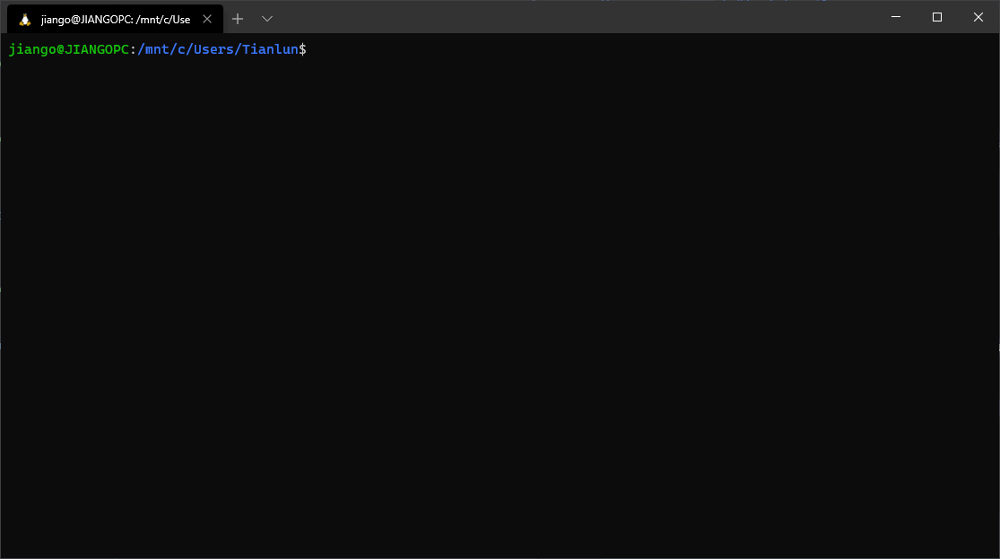

# Windows Subsystem for Linux (WSL) for use in VFX
it's cool for windows 10 to have WSL, but it has a few things that needs workarounds.

*(those are the steps noted via my own trial and error, so it might not be the industry standard)*

### Overview:

1. [Setup up WSL](#1.-Setup-WSL-in-Windows-10)
2. [Executing a Bash script & command launch applications](#2.-Execute-a-Bash-scrip)
3. [Environment Variables for your pipeline](#3.-Sharing-Environment-Variables) (I will do Nuke pipeline for this guide)
4. [`job` in or `go` to your show and shot](4.-job-in-or-go-to-your-show-and-shot)
5. Load show/shot tools in nuke (wip)


### 1. Setup WSL in Windows 10
I will let internet show you how to do this XD
- [How to setup `Bash` shell in windows 10](https://www.howtogeek.com/265900/everything-you-can-do-with-windows-10s-new-bash-shell/)
- [WSL Ultimate Guide](https://adamtheautomator.com/windows-subsystem-for-linux/)

After installation, your shell will rouchly looks like this



- WSL Home Dir: `/home/<username>/` (the username when you signin to your shell, not your windows username)
- WSL `C` Drive location: `/mnt/c/`
- WSL Dir in Windows filesystem: `C:\Users\<username>\AppData\Local\Packages\CanonicalGroupLimited.UbuntuonWindows_79rhkp1fndgsc\LocalState\rootfs\`


###### To command launch
in your `/home/<username>/.bash_aliases` or `.bashrc` file, add in the following line
```Shell
alias nuke='/mnt/c/Program\ Files/Nuke11.3v6/nuke11.3.exe'
# notice the '\ ' in the string for spaces in your filename
```

###### Access a network drive
Yes you need to **manually** map your network drive (if you are cool like me working off on a central server :P)

[windows subsystem for linux release note](https://docs.microsoft.com/en-us/archive/blogs/wsl/file-system-improvements-to-the-windows-subsystem-for-linux)

1. create an alias folder: `sudo mkdir /mnt/<AliasFolder>`
2. mounting the drive: `sudo mount -t drvfs '\\<NetworkDriveName>\<NetworkSharedFolder>' /mnt/<AliasFolder>`

### 2. Execute a Bash script
if you are using command-line arguments with bash scripts, there will be a `\r` at the end of each line, due to its windows characteristics, so 'low level' system knows it's end of a line (I think).

something like this:


to solve this problem, is to use `dos2unix` command

1. install `dos2unix` on Bash for windows
```shell
sudo apt-get update
sudo apt-get install dos2unix
```
2. using `dos2unix` to convert the Bash script:
```shell
dos2unix <yourBashFile>.sh
```

Do this every time you create a new line in your shell script

### 3. Sharing Environment Variables
WSL and Win system does not share environment variables other than the ones system predefined

When you launch nuke from WSL, its `HOME` dir will not be `/home/<username>`, it will still be your Windows filesystem username `C:\Users\<username>`, but you can work around this by using the `WSLENV` variable ([Online Guide](https://adamtheautomator.com/windows-subsystem-for-linux/#Sharing-Environment-Variables)):


**Transfer environment variables**
1. Bash end: pack variables to a single `WSLENV` variable
```bash
export WSLENV=${KP_SHOW}:${KP_SCENE}:${KP_SHOT}
```
2. Nuke end: unpack `WSLENV`
```python
SHOW, SCENE, SHOT = os.getenv('WSLENV').split(':')
```

### 4. `job` in or `go` to your show and shot
After few years working in the industry, I like the way how you can job in your show and shot and then all the show/shot tools are loaded when you launch the application.

I don't know how studios do it exactly and it differs from one to another. So I came up with my own solution.

**Basic Event Sequence**
1. `go <show> <shot>` to your shot in shell
2. execute a shell script
    - sets up `SHOW`, `SCENE`, `SHOT` environment variable
    - change dir to show/shot
3. command-line launch nuke
4. nuke reads environment variables set previously
5. loads python pipeline tools

Example script demonstrates Steps `2`
```bash
#! /bin/bash
export KP_SHOW=$1
export KP_SCENE=${2::-4}
export KP_SHOT=$2

export WSLENV=$KP_SHOW:$KP_SCENE:$KP_SHOT


SHOTPATH="/<yourProjectsPath>/${KP_SHOW}/${KP_SHOT}"
WINPATH="K:/${SHOTPATH:8}"

if [[ $# -eq 2 ]]
then
    if [[ -d "${SHOTPATH}" ]]
    then
        cd $SHOTPATH
        echo "== GO TO SHOT ========="
        echo "WinDir: $WINPATH"
        echo "Show:   $KP_SHOW"
        echo "Scene:  $KP_SCENE"
        echo "Shot:   $KP_SHOT"
        echo "======================="

        alias cdnuke="cd ${SHOTPATH}/workbench/nuke/"
        alias cdmaya="cd ${SHOTPATH}/workbench/maya/scenes/"

    elif [[ -d "<yourProjectsPath>" ]]
    then
        echo "SHOW or SHOT does not exist"
        echo "...Change dir to <yourProjectsPath>/" && cd "<yourProjectsPath>/"
    else
        echo "server not mounted"
        echo "mounting server..."
    fi
else
    echo "insufficient argument"
    echo "go <show> <shot>"
fi
```
